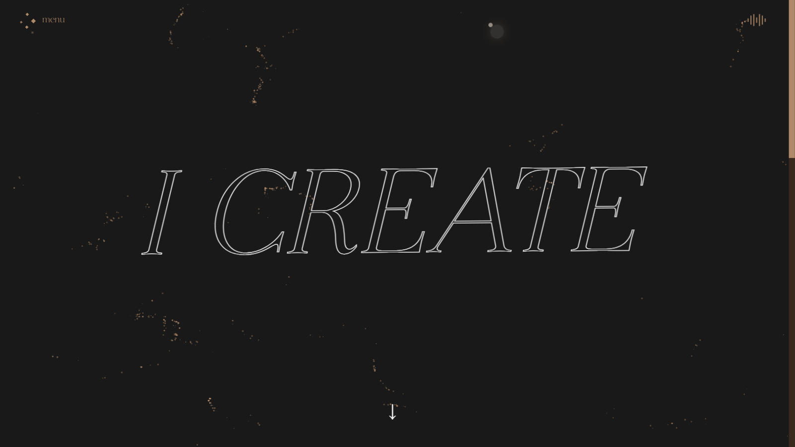
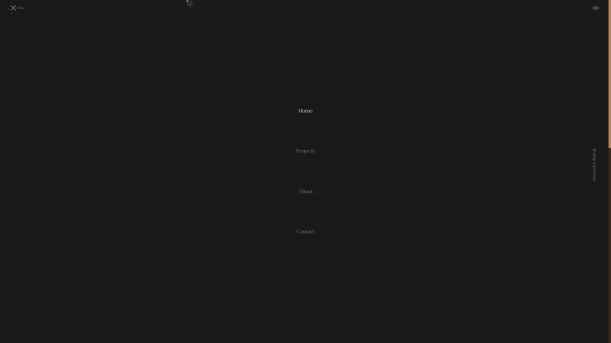
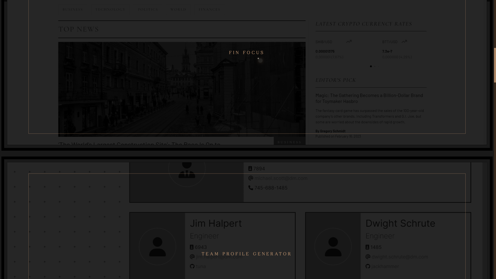

## Personal Portfolio

> Consider me a React fan

_Lemme do it for you_ :brown_heart:

My latest porfolio built using React@latest.
Meant to be viewed in latest browser versions (best in webkit). Design inspired by my original WordPress portfolio. All style done purely in scss.

## [Go look :star:](https://alexandrabatrak.netlify.app/)

## Features

- [x] Single page application powered by React JS
- [x] Smooth page(or sections whatever you call it) transitions
- [x] Custom cursor
- [x] Little custom parallax
- [x] Flowy particles effect responding to mouse movements (optimised for mobile to be less intence) using Perlin Noise flowfield and custom canvas setup using p5.js
- [x] On-scroll animations
- [x] JSON format content delivered beautifully
- [x] Responsive (!)
- [x] Not boring at all loading screen
- [x] Slider for projects' screenshots
- [x] So many little detailed animations (scss)
- [x] Chill background sound (of course, can be on/off and preferences are retained in localStorage)
- **And more**.

_P.S This is still work in progress (2 weeks was not enough)._

## Resources

_What did I learn?_ Hella lot :astonished:. I mean, this is the first time I used React ^\_^

Official documentation for React and used packages + some of the resources consumed during the development:
[1](https://bobbyhadz.com/blog/react-uselocation-may-be-used-only-in-context-of-router),
[2](https://haseeb-anwar.medium.com/react-with-sass-and-bootstrap-6eda9c61cd49),
[3](https://stackoverflow.com/questions/39195687/setting-a-backgroundimage-with-react-inline-styles),
[4](https://github.com/judygab/web-dev-projects/tree/main/personal-portfolio),
[5](https://codepen.io/ntenebruso/pen/QWLzVjY),
[6](https://codepen.io/antvo/pen/yXgOwd),
[7](https://www.aurigait.com/blog/how-to-implement-p5-js-javascript-canvas-library-with-react/),
[8](https://stackoverflow.com/questions/72349396/react-component-is-duplicated-with-p5-js-canvas),
[9](https://www.lloydatkinson.net/posts/2022/how-to-prevent-a-duplicated-canvas-when-using-p5-and-react-strict-mode/),,
[10](https://stackoverflow.com/questions/72274015/react-strictmode-double-initializasion-where-to-put-logic-that-should-be-execu),
[11](https://stackoverflow.com/questions/67134602/p5js-resizecanvas-is-not-a-function-on-resize),
[12](https://javascript.plainenglish.io/react-performance-optimization-ft-memoization-61b765c4c619),
[13](https://www.digitalocean.com/community/tutorials/how-to-avoid-performance-pitfalls-in-react-with-memo-usememo-and-usecallback),
[14](https://matthewjamestaylor.com/responsive-font-size#:~:text=When%20using%20responsive%20font%20sizes,to%20your%20base%20font%20size.&text=Using%20rems%20in%20this%20way,so%20they%20always%20look%20good.),
[15](https://stackoverflow.com/questions/47686345/playing-sound-in-react-js),
[16](https://stackoverflow.com/questions/59455917/window-addeventlistenerload-function-not-working-in-reactgatsby),
[17](https://blog.openreplay.com/creating-a-table-of-content-widget-in-react/),

## Packages

- [P5](https://p5js.org/)
- [React Icons](https://react-icons.github.io/)
- [Framer Motion](https://www.framer.com/motion/)
- [Formspree](https://formspree.io/)
- [SwiperJS](https://swiperjs.com/)
- [React responsive](https://www.npmjs.com/package/react-responsive)
- [React slugify](https://www.npmjs.com/package/react-slugify)
- [UUID](https://www.npmjs.com/package/uuid)
- [Sass](https://sass-lang.com/)

## Future Development

- Add custom illustrations
- Transform Resume to html format downloadable in PDF
- Optimise for slower networks
- Improve project details
- Add more sections to home page
- Connect different contact form with less restrictions
- Maybe, move whole thing to Next.js
- Translate page
- Add light theme

## Credits

- [Music](https://www.purple-planet.com/)
- [Ethereal font](https://creativemarket.com/kereatype/7012712-Ethereal-Elegant-Serif-Family)
- [Bunny fonts](https://fonts.bunny.net/) :rabbit2: [Martel font](https://fonts.bunny.net/family/martel) by [Dan Reynolds](http://sorkintype.com/)

## Licence

All rights reserved. :exclamation: **You have no permission to use, modify, or share the code. Although a code host such as GitHub may allow you to view and fork the code, this does not imply that you are permitted to use, modify, or share the code for any purpose.**

Copyright 2023 :copyright: Alexandra Batrak
